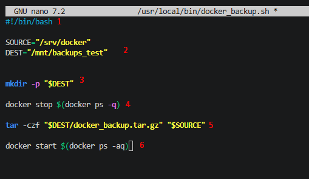
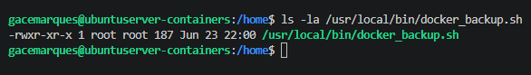

#### Showcase of a simple backup script

For standardization let's create a .sh script in **/usr/bin/bash**

```bash
sudo nano /usr/bin/bash/docker_backup.sh
```




1. First we tell the system that we're using **BASH** to run the script
2. Defining PATHs as **variables**
3. Creating a directory for the backup destination

4. We want to stop containers before we back them up so (backing up live containers risks corrupting the archive if files are written mid-backup.):
	- docker stop - stops a container
	- docker ps - lists containers
	- -q (Lists ID of running containers)

5. Compressing the folder we want - syntax
	- TAR - command
	
	- -c (Creates the archive)
	- -z (Compresses with gzip)
	- -f (Specifies the output filename)
	
	- And then we fetch the source

6. Now we want to start the containers again:
	- docker start - starts a container
	- docker ps - lists containers
	- -aq (Lists ID of all containers)


Now we just make the script executable for everyone since it's a system script run by root:

```bash
chmod +x /usr/local/bin/docker_backup.sh
```

Check the permissions with **ls -la**




___

## Now to run the script just call it:

```bash
sudo /usr/local/bin/docker_backup.sh
```