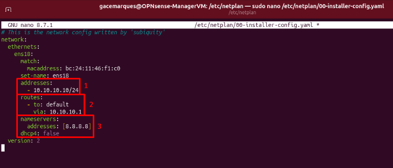

## Ubuntu:

```bash
sudo nano /etc/netplan/xx-installer-config.yaml
```

Add these lines into the netplan yaml:



1. Static IP Address/Subnet
2. Gateway
3. DNS Server

Save, exit and apply:

```bash
sudo netplan apply
```