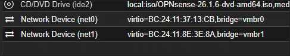
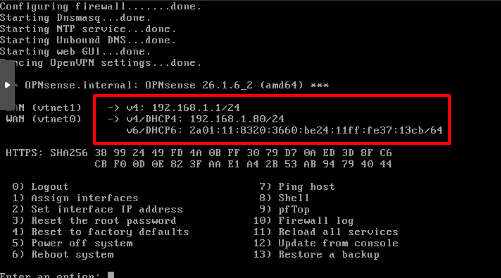
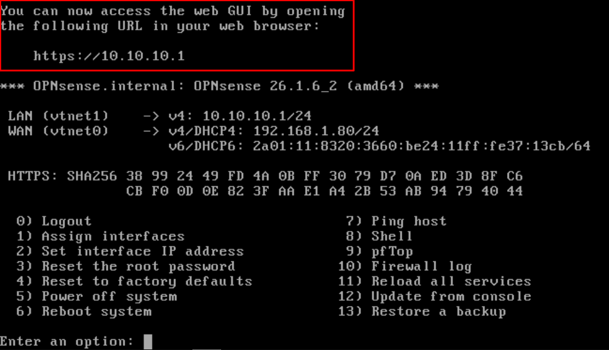

#### 1 - Create the OPNsense VM

```
OS type: Other
CPU: 2 cores
Memory: 4096 MB
Disk: 20GB
```

> [!warning] ZFS install warns below 3000MB RAM and may produce a corrupted/unbootable install (happened once during this build - fixed by bumping RAM to 4096MB and reinstalling). Set RAM to 4096MB before installing, not after.

**Network (2 NICs required):**

```
NIC 1 (net0): Bridge vmbr1=>WAN, Model VirtIO, Firewall unchecked
NIC 2 (net1): Bridge vmbr1, Model VirtIO, Firewall unchecked
```



---

#### 2 - Install OPNsense

Boot VM with ISO attached.

```
login: installer
password: opnsense
```

- Skip config import (press Enter on blank to exit)
- LAGGs: n
- VLANs: n
- Choose task: Install (ZFS)
- Virtual device type: stripe (single disk, no redundancy needed)
- Select disk
- Set root password

> [!warning] Remove/eject the CD/DVD drive in Proxmox Hardware before rebooting, or the boot order may loop back into the installer.

---

#### 3 - Assign interfaces (console, option 1)

Match MAC addresses shown against the Proxmox Hardware tab to confirm which `vtnetX` is which before assigning - don't assume order.

```
WAN interface name: vtnet0
LAN interface name: vtnet1
Optional interfaces: (none, press Enter to finish)
```

---

#### 4 - Fix LAN subnet conflict

Default LAN was `192.168.1.1/24`, same subnet as the real network WAN picked up via DHCP (`192.168.1.80/24`) - conflict, needs changing.



Console, option 2 - Set interface IP address -> LAN:

```
Configure via DHCP: n
New LAN IPv4 address: 10.10.10.1
Subnet bit count: 24
Upstream gateway: (blank - LAN doesn't need one, it IS the gateway for its segment)
IPv6 via WAN tracking: n
IPv6 via DHCP6: n
IPv6 address: (blank)
Enable DHCP server on LAN: n (for now, configure later via web UI)
Change web GUI protocol to HTTP: n (keep HTTPS)
Generate new self-signed cert: n
Restore web GUI access defaults: n
```

Result: LAN now on `10.10.10.1/24`, no longer conflicting with WAN's subnet.



---

#### Status: GUI access pending

`10.10.10.1` is only reachable from a device on `vmbr1`. Next step: create a small client VM with its NIC on `vmbr1`, statically assign it an IP in `10.10.10.0/24` (e.g. `10.10.10.10`), and browse to `https://10.10.10.1` from there to continue setup in the web GUI.

> [!tip]
> I only created a different nic for configuration/testing purposes with this firewall because i dont want it messing with my home network. I'll have a different subnet and a Test VM to access the web interface.