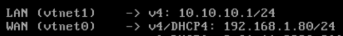

# Let's start by accessing the web interface

- I gave my firewall a different subnet for testing
- Managing it with a test vm in the same subnet

___
# Configuration wizard

For simplicity I'm using the configuration wizard for initial setup and anything more complex i'll do manually later

- Next

- Here all I'm doing is setting a fallback DNS server in case Unbound resolver fails

- **Override DNS**: Leaving it checked means OPNsense pushes its own DNS to DHCP clients
- **Enable Resolver**: Unbound (local DNS resolver)

## WAN

###### Type DHCP

- Gets an ip from my router via **vmbr0** (that i configured earlier in the installation) since I'm using this firewall between my private network and a test VM

###### Block RFC1918 Private Networks

- I'd leave this check but again since my wan is actually a private IP from my home network i need to uncheck it

## LAN

Comes pre-configured with OPNsense's IP and subnet

- Leaving DHCP on for tests later

## Deployment type

- **Optimize for Multiwan**: checked by default, no harm in a single-WAN setup

- **Automatic DHCP/DNS registration**: hostnames of DHCP clients get registered in Unbound automatically

- **Optimize for IPsec**: Leaving this unchecked since i'm not doing VPN tunnels here

## Password and finish

- Just set up a root password and finish the setup