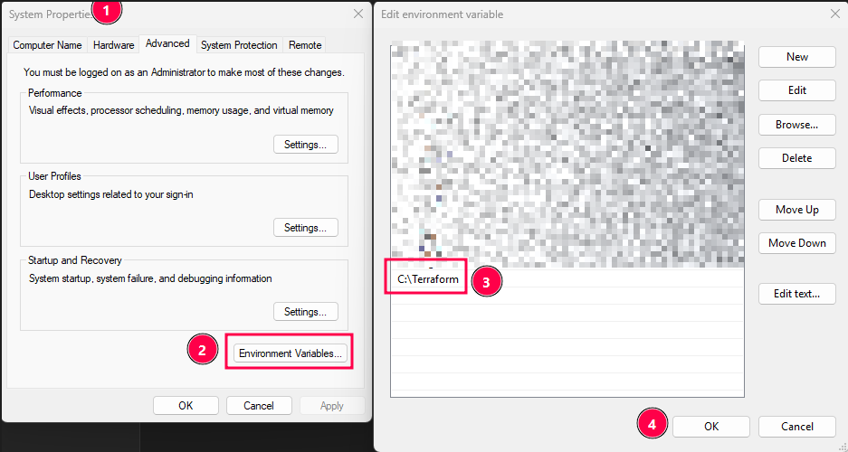

# Setting up Terraform

Since I have a Proxmox node in a server and my main desktop I'll be installing it on my main PC. All it will need is network reachability to my Proxmox API.

___
#### Download the binaries from the official website

https://developer.hashicorp.com/terraform/install

#### Put them somewhere permanent

- I put them in "C:\Terraform"

#### Add the folder to your path as per usual

