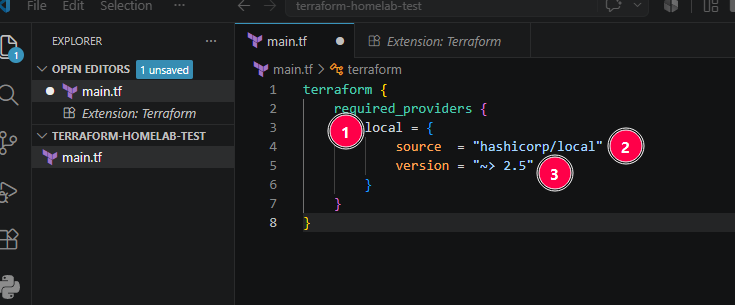
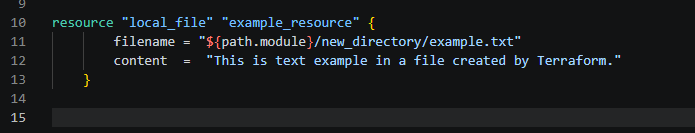

# Main.tf Basics

> [!NOTE]
> First create a **main.tf** file in your folder

___
### Set up a local provider

1. **`local`** = a nickname you give the provider to refer to it in this config;
2. **`source`** = where Terraform downloads the provider from;
3. **`version`** = which versions are allowed. `~>` means this or higher, but stay below the next major version. So it wouldn't go to a 3.x version in this case.

___ 

### Set up a resource

> [!NOTE]
> I'm creating a simple .txt file as a resource for visualization purposes

1. **`resource "local_file" "greeting"`** = `resource` starts the block. `"local_file"` is the resource type from the provider; `"example_resource"` is the name you give this instance;
2.  **`filename =`** the path and name of the file to create;
3.  **`content =`** the text or content to put inside that file;
4. **`${path.module}`** = the folder containing the current `.tf` file.
	- If the directories don't exist, they will be created
	- In this case "new_directory" will be created after running terraform

___