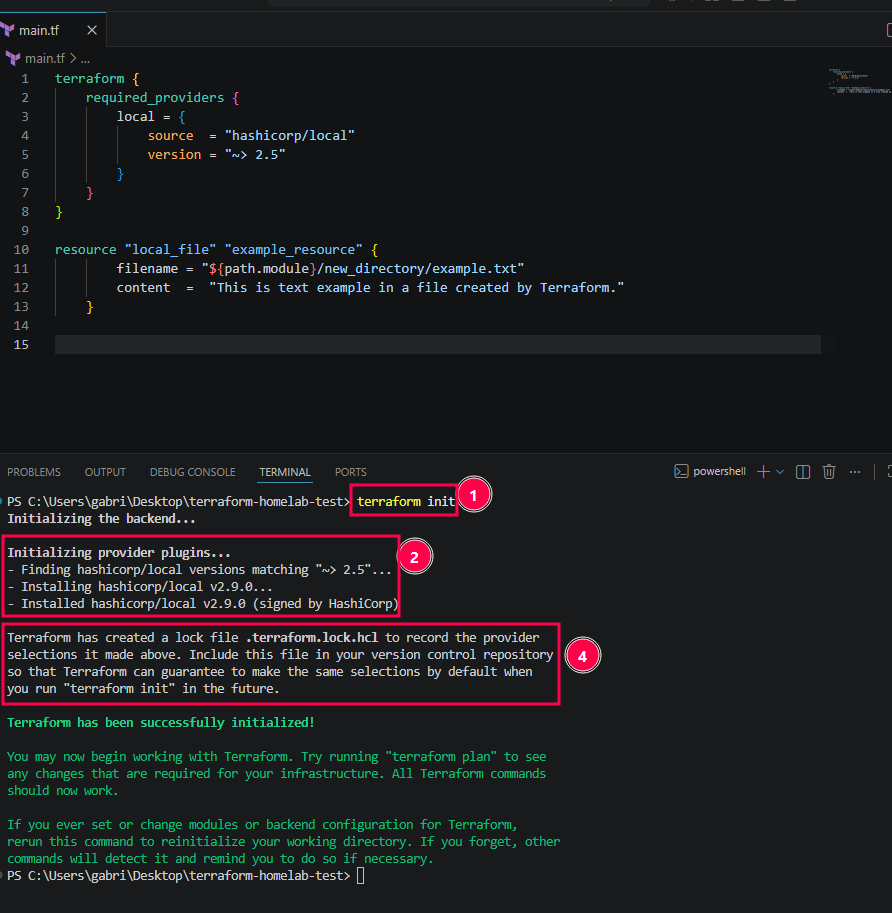
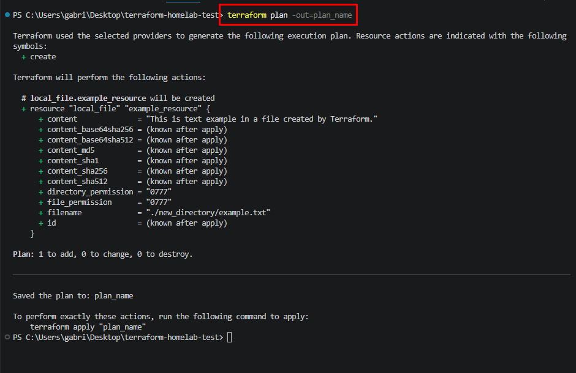
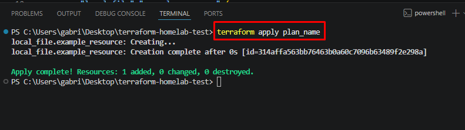
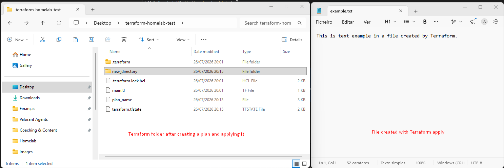

# Terraform - Commands
___
## Terraform Init

> [!NOTE]
> `terraform init` sets up the project folder, it doesn't create infrastructure yet.



1. Reads your `.tf` files to see which providers you need
2. Downloads those providers into a `.terraform` folder
3. Sets up where state will be stored (local file by default)
4. Writes `.terraform.lock.hcl` to lock exact provider versions

___

## Terraform Plan and Apply

> [!NOTE]
> Terraform used the selected providers to generate the following execution plan

	

```bash
+       Create
-       Destroy
~       Update occuring
-/+     Destroy and recreate 
```


> [!NOTE]
> With `-out` you capture the exact plan as a file, then apply that specific file:


## Now I just apply the plan created

