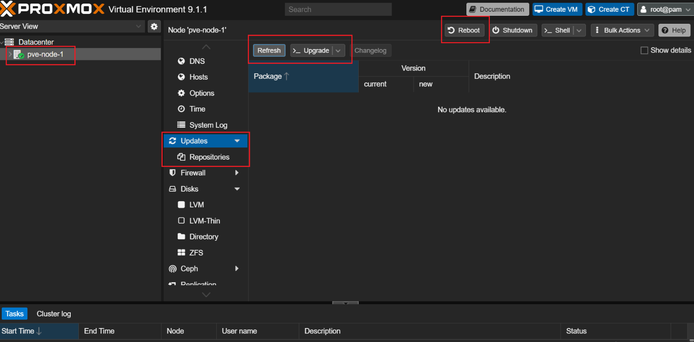

# Updating a Proxmox Node

1. Select the node in the left-hand menu
2. Go to **Updates → Refresh**, and wait for it to complete
3. If not already configured, enable the no-subscription repository:
   **Updates → Repositories → Add → Repository (No-Subscription)**
4. Refresh again to pull updates from the new repository:
   **Updates → Refresh**
5. Once ready, click **Upgrade** to commit the updates
