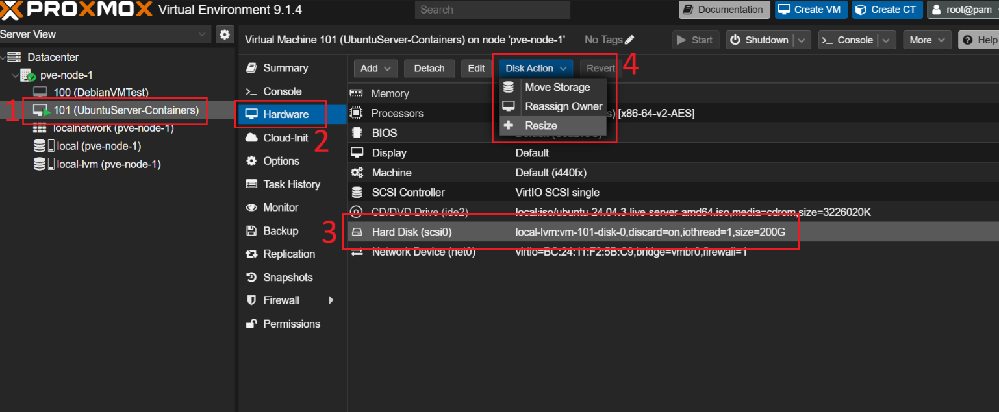
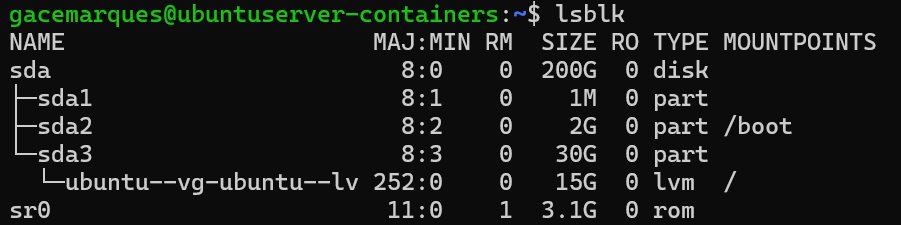
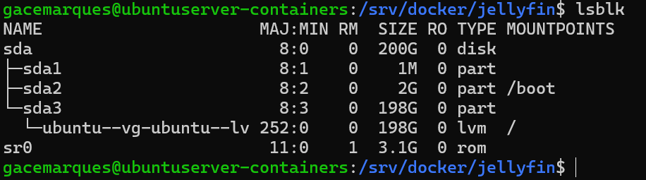

# Disk Management
## Resizing a VM disk


1. Select the VM → **Hardware** tab
2. Select the disk to resize → **Disk Action → Resize**
3. Specify how much additional space to add

Inside the guest, verify with `lsblk`, then expand the partition and filesystem to use the new space:



```bash
sudo growpart /dev/sda 3            # expand the partition
sudo pvresize /dev/sda3             # expand the physical volume
sudo lvextend -l +100%FREE /dev/ubuntu-vg/ubuntu-lv   # expand the logical volume
sudo resize2fs /dev/ubuntu-vg/ubuntu-lv               # expand the filesystem
```

## Final result:



---

## Adding a new physical disk to a node

Run from the Proxmox shell:

```bash
lsblk                                # identify the new disk (e.g. sda, sdb — nvme0n1 is usually the Proxmox disk)
umount /dev/DISKNAME 2>/dev/null     # unmount if needed
mkfs.ext4 /dev/DISKNAME              # format
mkdir -p /path/to/mountpoint         # create the mount point
mount /dev/DISKNAME /path/to/mountpoint
df -h | grep mountpoint              # verify
```

To make the mount persistent (only do this if the disk is **not** also being mounted inside a VM — avoid two machines fighting over the same disk):

```bash
blkid /dev/DISKNAME                  # get the UUID
nano /etc/fstab                      # add a line:
# UUID=YOUR-UUID-HERE  /path/to/mountpoint  ext4  defaults  0  2
```

Test before rebooting:

```bash
umount /path/to/mountpoint
mount -a
df -h | grep mountpoint
```

---

## Attaching a physical disk to a VM

### - Proxmox Shell

> [!NOTE]
> > ONLY DO THIS AFTER MOUNTING IT ON PROXMOX FIRST

- Get Persistent disk ID:

		 ls -l /dev/disk/by-id/ | grep sdX

> **Output example**: usb-TOSHIBA_External_USB_3.0_XXXX -> ../../sda

- Attach to VM (example VM ID 101)

```bash 
qm set 101 -scsi1 /dev/disk/by-id/usb-TOSHIBA_External_USB_3.0_XXXX
```

> [!NOTE]
> - QM set XXX (VM number in proxmox)
> - Copy the disk ID and paste at the end as shown
**Inside the VM:**

### - VM Shell


```bash
lsblk                                # confirm the new disk is visible
sudo mkdir -p /mnt/media             # create the mount point
sudo mount /dev/sdX1 /mnt/media      # mount it
df -h | grep media                   # verify
```

> [!NOTE]
> The path was made the same as the one we created in proxmox for simplicity but it DOES NOT have to be the same
> 
> We can for example mount them differently on proxmox and the VM
> 
> 	Proxmox:
> 	- /mnt/externaldrive1
> 	
> 	VM:
> 	- /storage/jellyfin

#### FSTAB - Make the mount persistent

Get UUID:

```bash
sudo blkid /dev/DISKNAME
```

FSTAB:

```bash
sudo nano /etc/fstab
```

Add:

```bash
UUID=YOUR-UUID-HERE  /mnt/media  ext4  defaults  0  2
```

#### Test before reboot

```Bash
sudo umount /mnt/media
sudo mount -a
df -h | grep media
```

If no errors -> Good