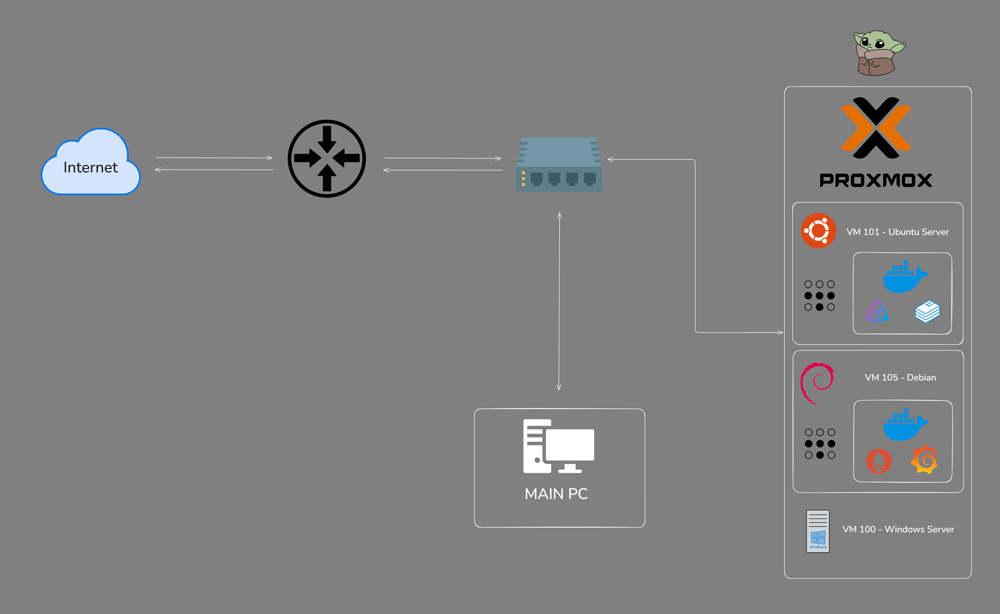

# Architecture

## Traffic flow

1. **Internet** → router → switch
2. Switch fans out to:
   - **Main PC** (workstation, also used for management access)
   - **Proxmox host** — runs all virtualized infrastructure

## Proxmox host

Single node currently, with three VMs:

- **VM 101 — Ubuntu Server**: Docker host for the media stack (Jellyfin, *arr suite, Bookstack)
- **VM 105 — Debian**: Docker host earmarked for the monitoring stack (Prometheus, Grafana) and Pi-hole
- **VM 100 — Windows Server**: Active Directory Domain Services, DNS, and DHCP for the lab domain

## Remote access

Tailscale runs on the relevant VMs to provide secure remote access without exposing any ports directly to the internet — all access from outside the LAN goes over the tailnet.

## Notes

- Second Proxmox node planned, to allow VM migration/HA testing and to split workloads further
- Network is segmented across two bridges (`vmbr0` for management/AD traffic, `vmbr1` for DHCP-assigned client VMs) — see [`docs/networking/ad-dns-dhcp.md`](../docs/networking/ad-dns-dhcp.md) for details
